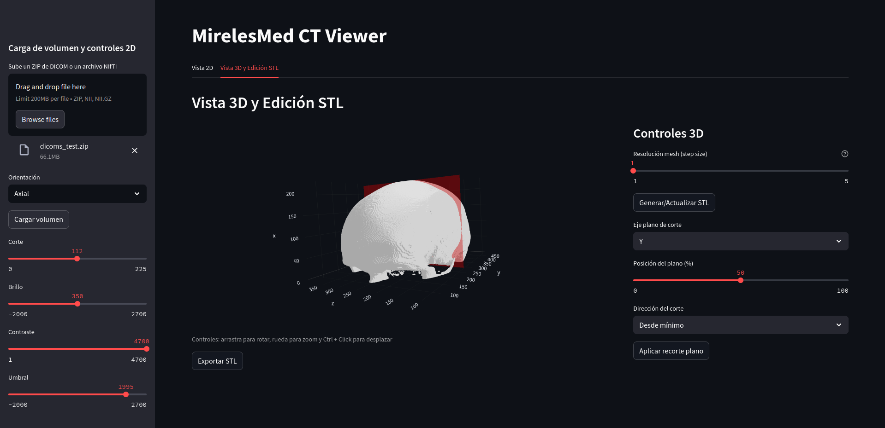
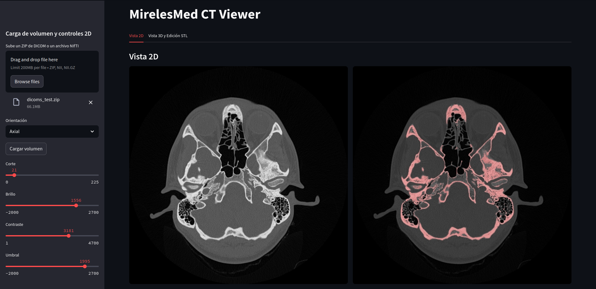

# Online DICOM Viewer

Este proyecto ofrece un visor de volúmenes DICOM y NIfTI construido con **Streamlit**. Permite explorar cortes 2D, generar mallas 3D y exportarlas a STL de forma sencilla.

## Características principales

- Soporte para series DICOM (comprimidas en ZIP) y archivos NIfTI.
- Visualización de cortes axiales, coronales y sagitales.
- Generación de mallas 3D mediante *marching cubes* con opción de recorte.
- Descarga de la malla en formato STL.

## Instalación

### Clona este repositorio

### Instala las dependencias

```bash
pip install -r requirements.txt
```

Si cuentas con una GPU compatible, las bibliotecas `cupy` y `cucim` se
aprovecharán automáticamente para acelerar el procesamiento.

### Ejecuta la aplicación

```bash
streamlit run app.py
```

### También puedes usar Docker

```bash
docker build -t dicom-viewer 
docker run -p 8501:8501 dicom-viewer
```

### O bien, con docker-compose

```bash
docker-compose up
```

## Uso

Al iniciar la app podrás subir un ZIP con archivos DICOM o un archivo `.nii/.nii.gz`. Selecciona la orientación deseada, ajusta brillo, contraste y umbral, y navega por los cortes. En la pestaña de **Vista 3D** podrás generar la malla y exportarla.

## Preview





---
